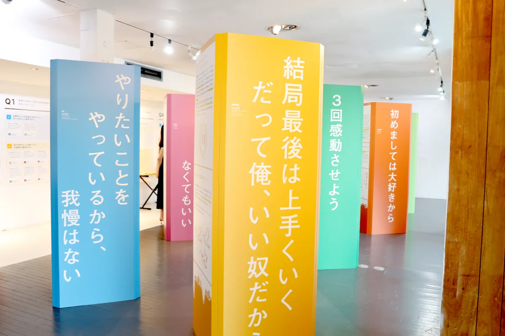
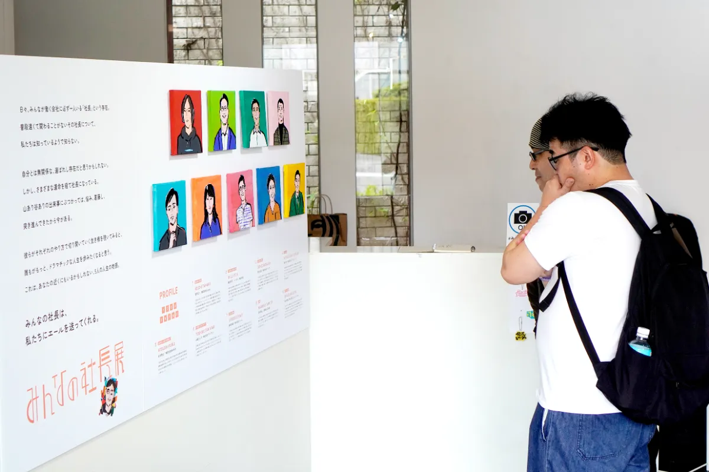
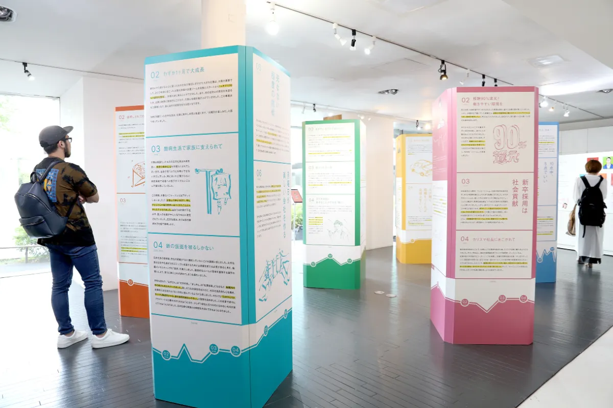
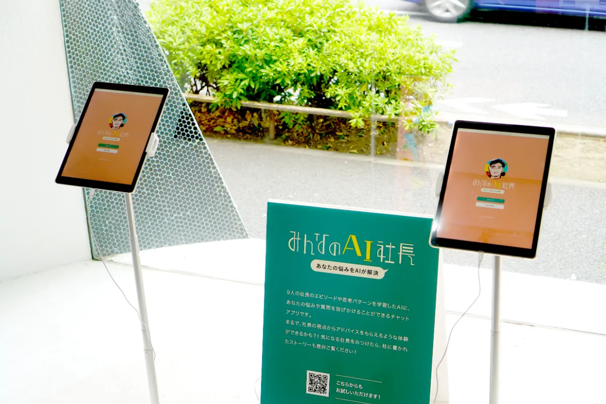
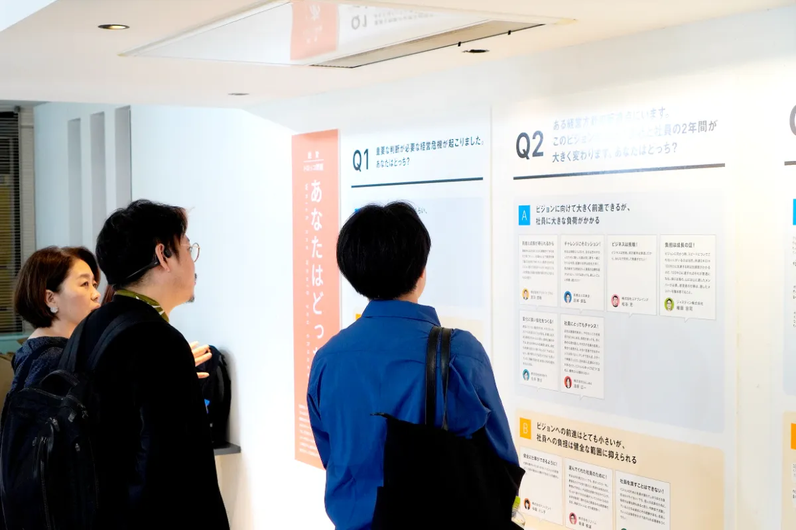

# 背景

日本企業の99.7%を占める中小企業。その経営者たちは、日本経済を支える存在でありながら、その人生や価値観が語られる機会はほとんどありません。メディアに登場するのは一部の大企業のトップばかりで、多くの人にとって「社長」は遠くて特別な存在に思われがちです。しかし実際には、肩書きも資金もないところから挑戦し続ける姿にこそ、共感できる生き方がある。そこで私たちは、「社長」のリアルな人生を、誰もが自分ごととして捉えられる展示会を開催。起業や経営に関心のない人にも、生き方のヒントとして届けることを目指しました。

# 目的

本展の目的は、中小企業の社長の「人生と価値観」をデザインの力で可視化し、誰もが“経営のリアル”に触れられる場をつくることです。

- 経営者の生き方を、インタビューに基づいたストーリーとして伝える
- 意思決定の背景にある価値観を、来場者自身の視点とつなげる
- 「会社をつくる・続ける」ことの本質を体験として理解できるようにする
- これから社会に出る若い世代が、ロールモデルと出会う機会をつくる

社長という特殊な職業を“遠い存在”ではなく、ひとりの人間としての魅力や葛藤が伝わる存在へと再解釈すること。\
それが、みんなの社長展が目指す世界です。

<iframe
  src="https://www.youtube.com/embed/i0vKJasB_J8?si=luW07GaZ7CH6XAP0"
  title="YouTube video player"
  allowfullscreen
  style="display: block; width: 100%; aspect-ratio: 16 / 9; border: 0; margin-bottom: 32px"
></iframe>

# 体験

## 9人のストーリー

なぜ社長になり、どのような道を歩んできたのか。\
中小ベンチャーの社長の人生をグラフとストーリーでたどります。

## AI社長

9人の社長のリアルな言葉と思考を学習したAI。\
あなたの悩みに、“社長らしい視点”で答えてくれます。

## 経営トロッコ問題

あなたなら、どちらの選択をする？\
経営者ならではの、意思決定のジレンマを疑似体験できます。

## 名言ガチャガチャ

社長たちの人生から生まれた“名言”入りキーホルダー。\
心に響く言葉との偶然の出会いを楽しめます。

# 結論

みんなの社長展は、来場者から次のような声を多くいただきました。

- 「社長って怖いイメージだったけど、すごく人間らしい」
- 「働く理由を考え直すきっかけになった」
- 「自分の価値観が可視化されて面白い」
- 「AI社長と話したら、本当に励まされた」

また、展示に参加した社長からも、

- 社員や家族が社長の人生を理解できた
- 採用や広報の素材として活用できる

といった反響があり、展示の意義が広がりました。

# CurioSwitchの担当

企画/全体統括/UXデザイン/エンジニアリング
