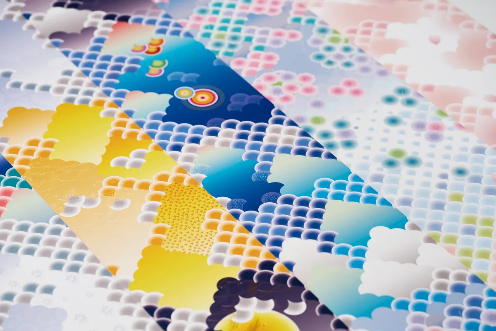

At the beginning of the year, Japanese people traditionally exchange New Year's
cards to wish one another health and happiness in the year ahead.
For 2024, the Year of the Dragon, we created a New Year's card inspired by an
"ascending dragon," a symbol of rising fortune and strength.

Drawn across the scales of the 3.5-meter dragon are the four seasons of Japan:
the sunrise that signals the start of the year, spring cherry blossoms, rainy
season umbrellas, summer fireworks shared with loved ones, the joy of autumn
harvests, winter snow crystals, and finally the sunset that marks the close of
another year.

These transitions are expressed through a gradient reminiscent of the obi on a
festive kimono.
By layering emotional shifts onto the changing seasons and onto the passage of
time from sunrise to sunset, we aimed to evoke a scene that has likely remained
deeply relatable, past and present, for anyone raised in this country.

We layered that seasonal progression into the dragon's ascent, filling it with
hope and anticipation for the year ahead.
In print, the card is read by physically drawing it along like an illustrated
scroll, while in digital form it is revealed through scrolling, turning the act
of reading the card itself into the dragon's upward rise.

