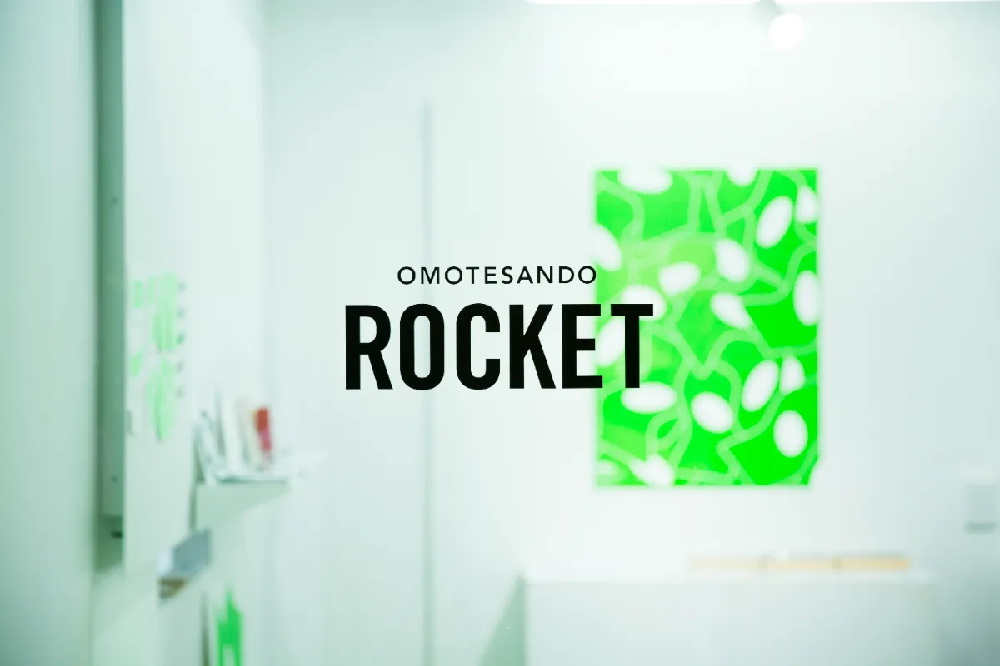
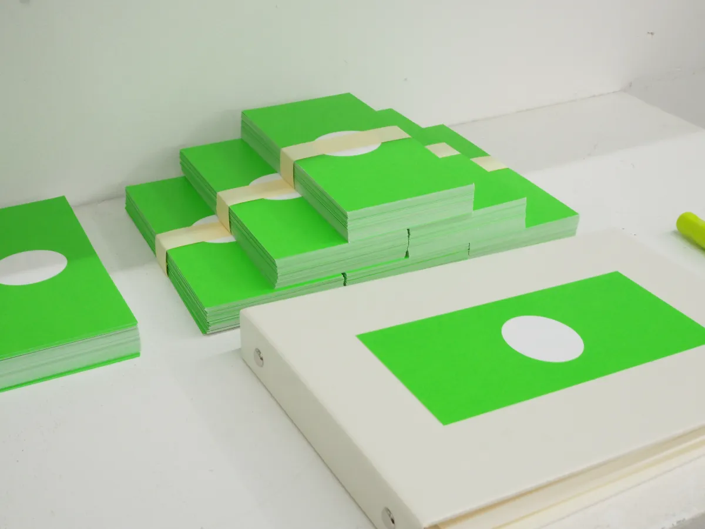
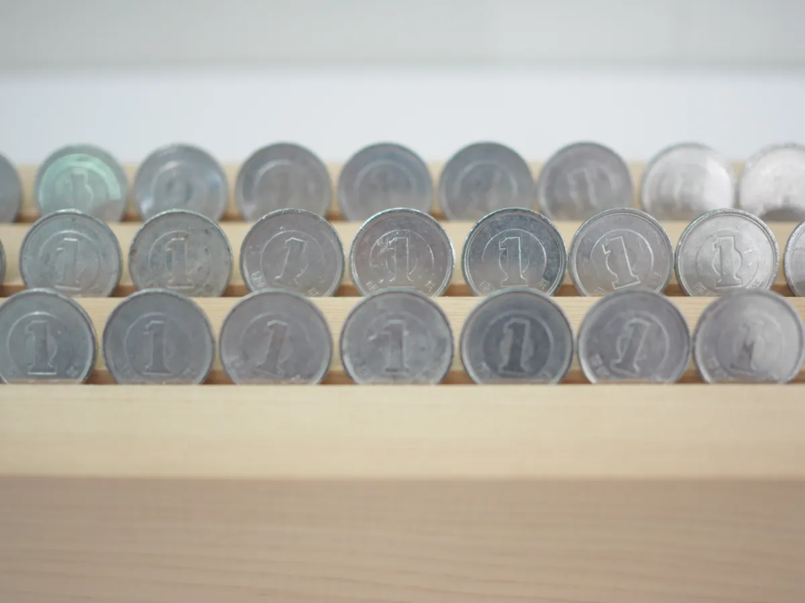
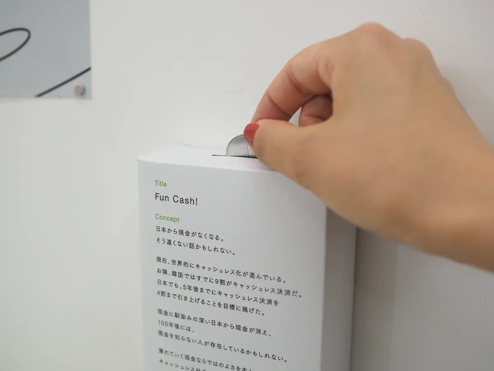
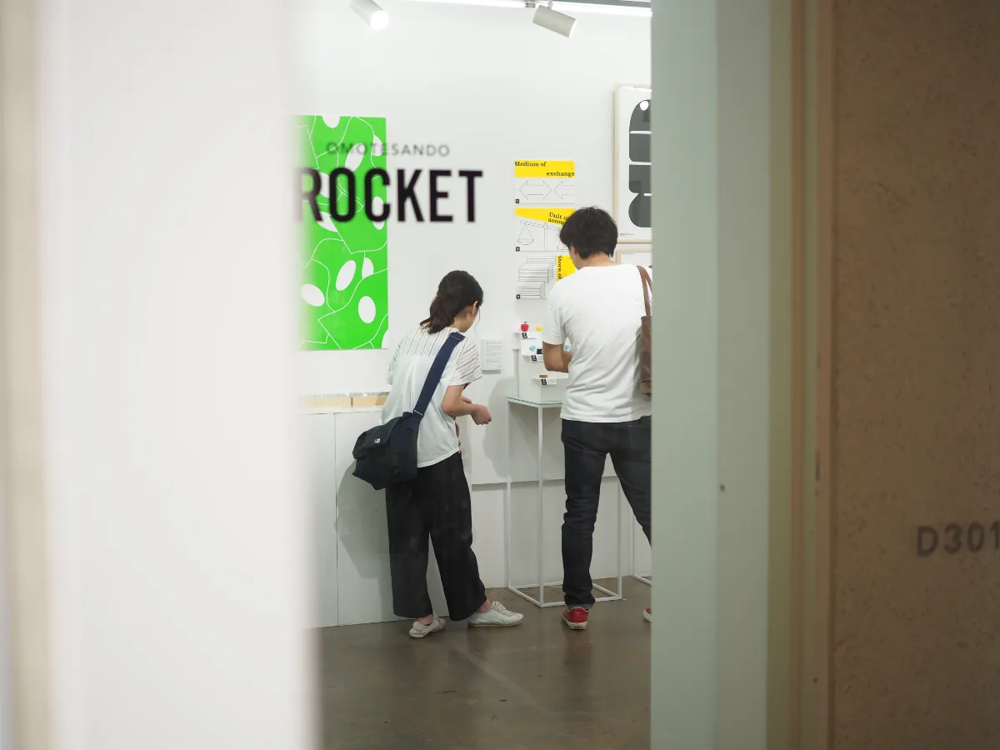
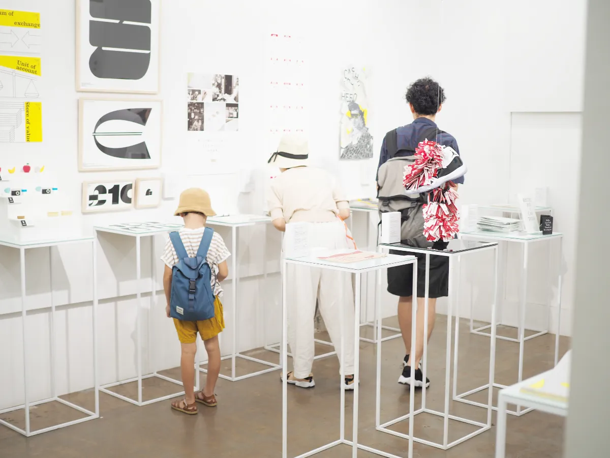
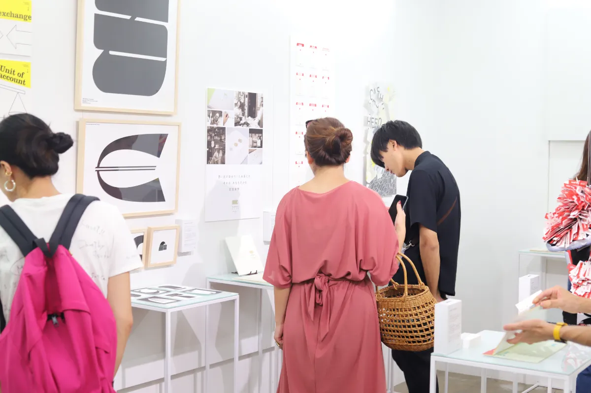

これからのお金ってなんだろう？\
キャッシュレス化や年金問題、2019年10月に控えていた増税など、今人々の心を揺るがしているお金をテーマに、グラフィック・メディアアート・プロダクトな\ど様々なバックグラウンドをもつ17名のアートディレクターによる合同展を開催しました。

　本展では、それぞれのアートディレクター自身の考えるお金の課題（弱み）を発見しその解決策として制作した未発表作品を展示。会場ではお金に関するアイディアの価値を、お金で評価してもらうため、来場者に投票券として「本物の1円玉」をお渡しし、投票を行う他、財布にきれいに収まる「本物の1万円札と同じ大きさ」のフライヤーを配布しました。

プレスリリース・Webサイト・DMなどを配付し11媒体のメディアに取り上げて頂き、6日で486人と多くの方にお楽しみいただくことができました。

弱みを握る寿司屋というクリエイティブチームで作成しました。\
CurioSwitchは、企画・進行管理と展示物を担当しました。