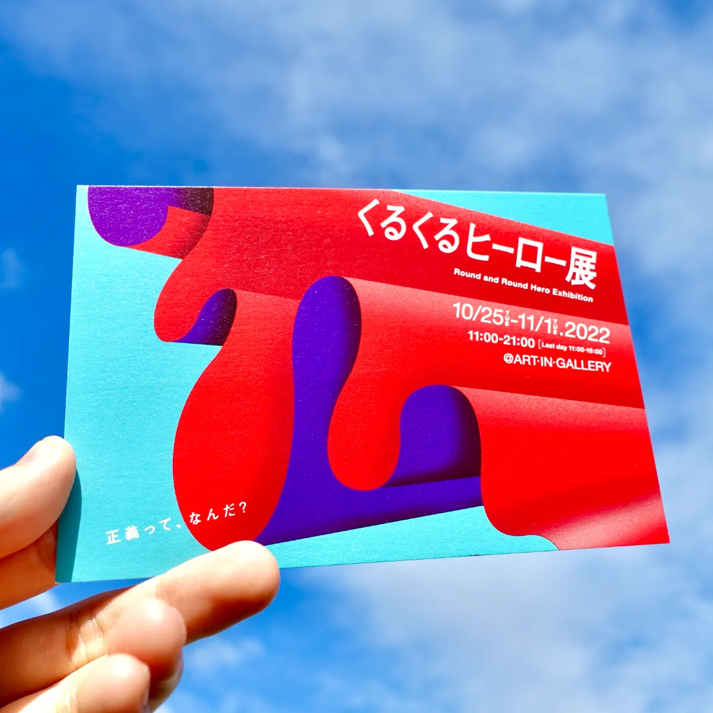
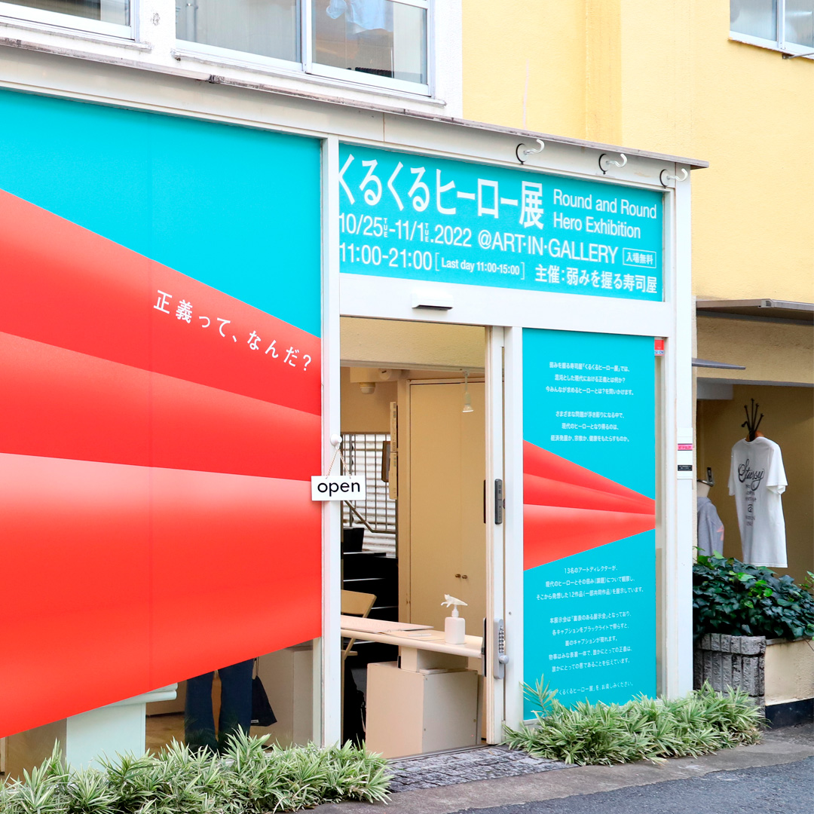
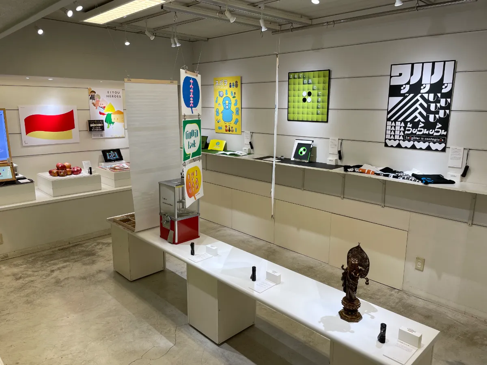
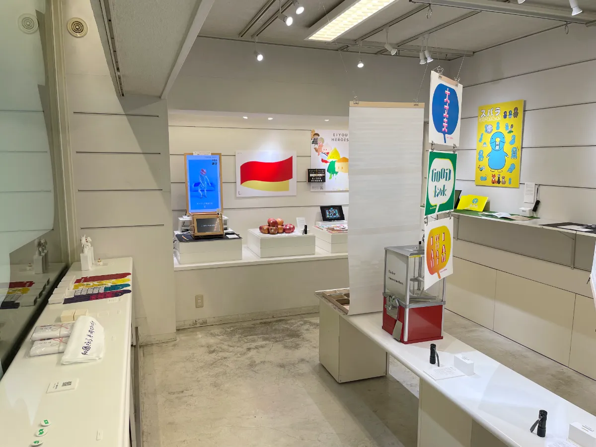
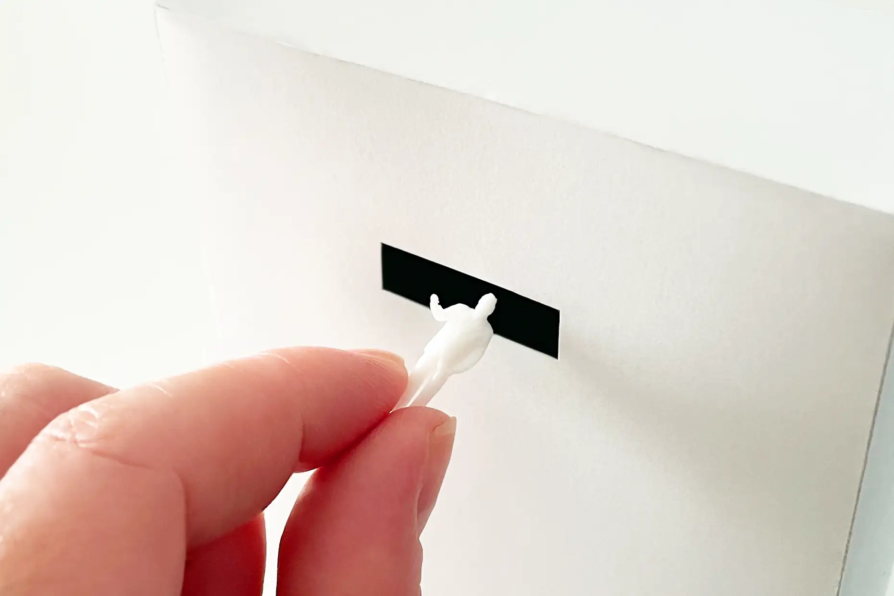
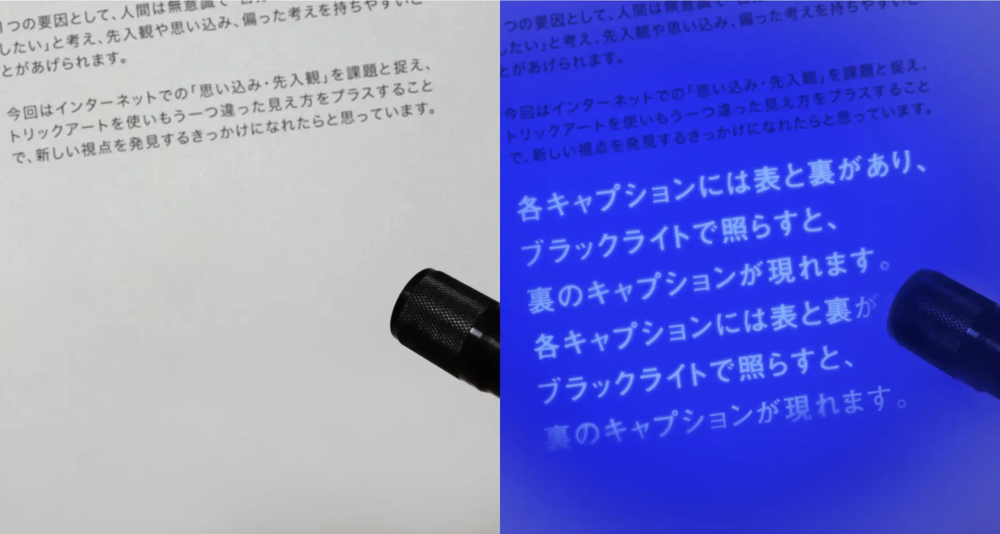

At "Kurukuru Heroes Exhibit," created by Yowami wo Nigiru Sushiya, we asked:
what does justice mean in today's chaotic world, and what kind of hero are
people looking for now?

We sometimes become fixated on only one side of a situation and come to
believe that it alone is justice. As many kinds of problems come into view, we
asked whether today's hero might be economic growth, religion, something that
brings health, or perhaps no one at all. Thirteen art directors observed
possible modern heroes and their weaknesses or challenges, then exhibited
twelve works, including collaborative pieces, inspired by those reflections.

We wanted every visitor to cast one vote for the idea they felt would save the
world the most, so we handed out one miniature human figure to each person.
Visitors then voted for their chosen hero idea by placing their own stand-in
figure with it.

This exhibition was designed to have both a visible side and a hidden reverse
side. Each caption had a front and back, and when illuminated with a
blacklight, the caption on the reverse side appeared.

The exhibition was created by the creative team Yowami wo Nigiru Sushiya.
CurioSwitch was responsible for planning, project management, and the
exhibition materials.
