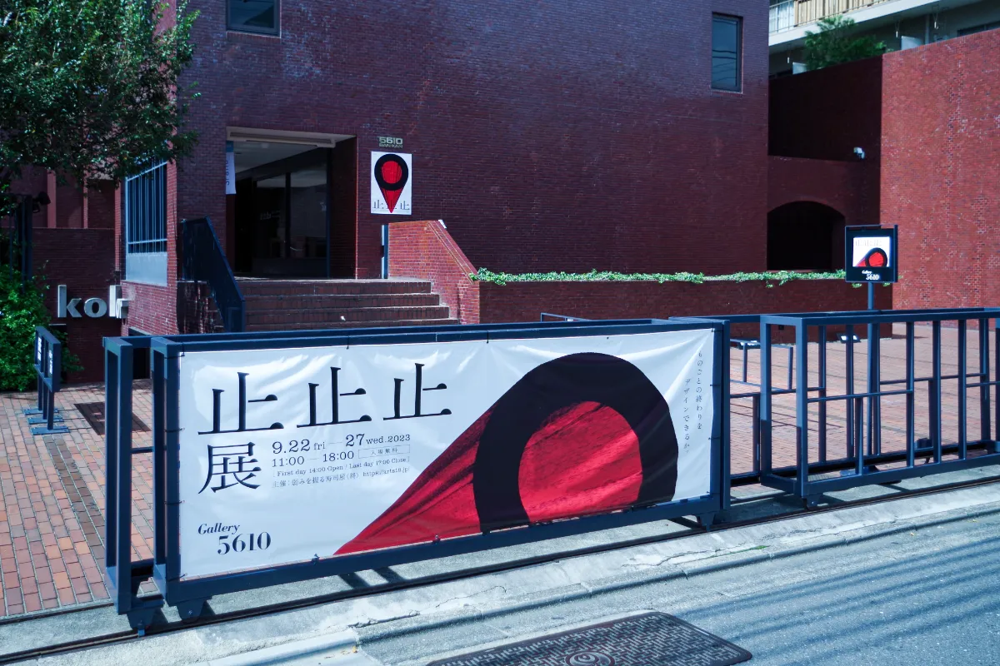
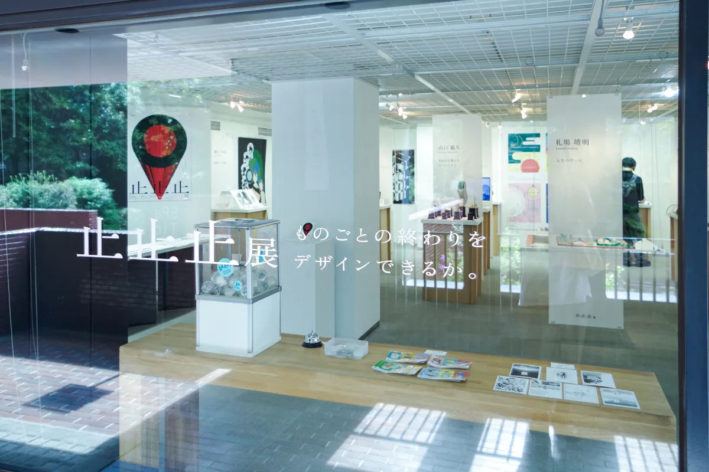
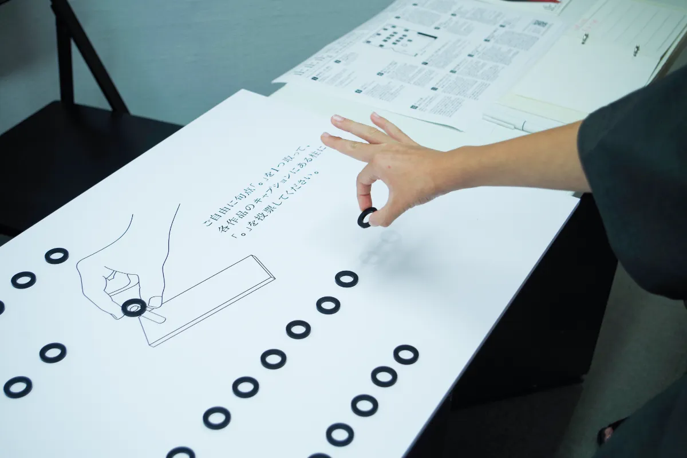
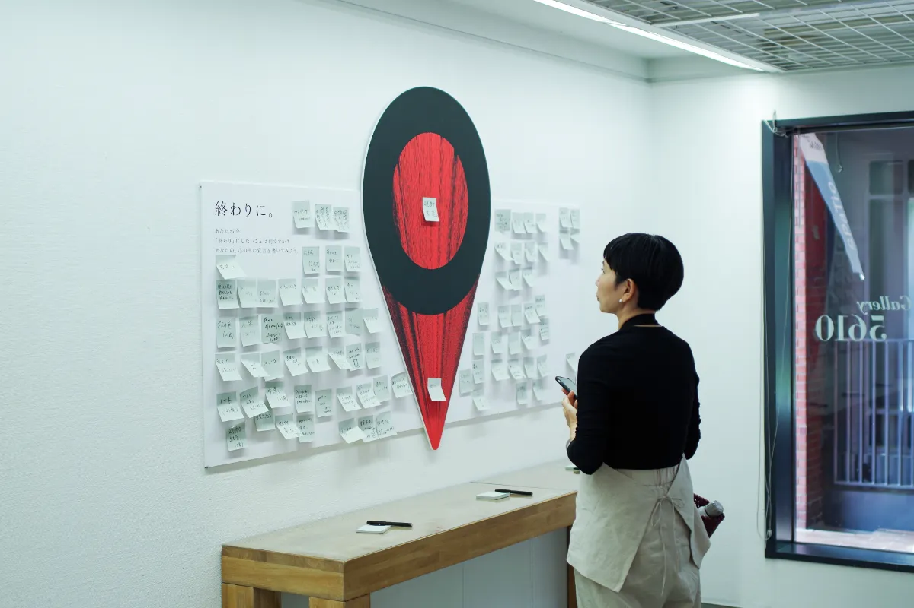
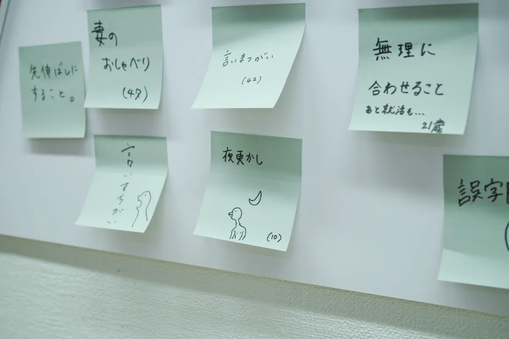
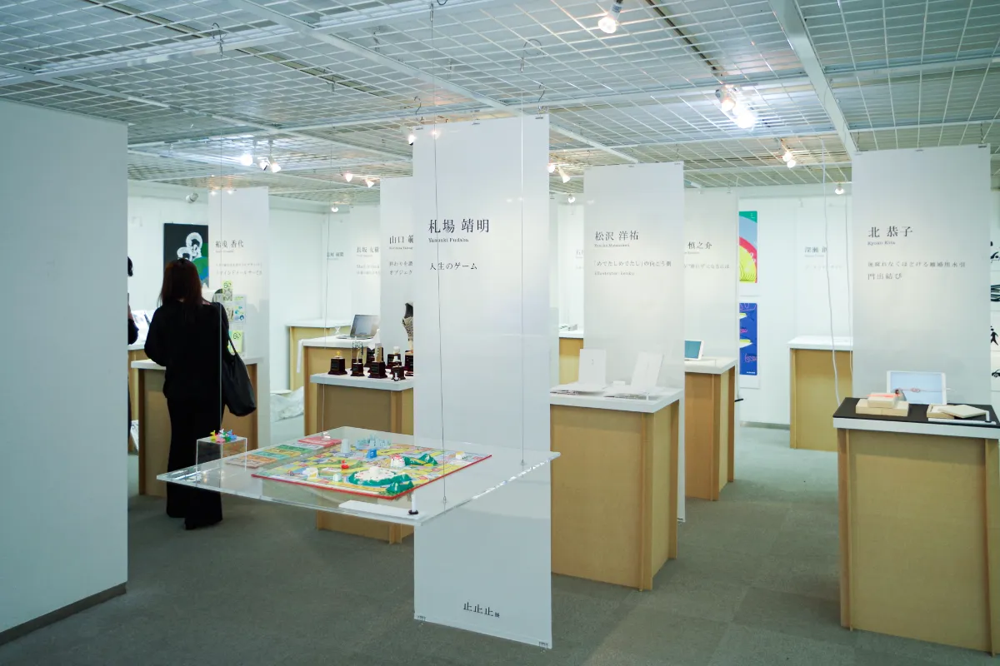

If every beginning must have an end, why are we never taught how to end
things? The end of COVID. The beginning of a new era. Fifteen art directors from
backgrounds including graphic design, media art, and product design exhibited
previously unreleased works on the theme of "endings," something we rarely
stop to think about in daily life.

We gave each visitor one Japanese period mark, "。", and asked them to vote for
the work about endings they found most compelling.

At the end of the venue, we set up an "Ending Declaration Corner" where
visitors could write down what they want to bring to an end right now.

The exhibition was created by the creative team Yowami wo Nigiru Sushiya.
CurioSwitch was responsible for planning, project management, and the
exhibition materials.
