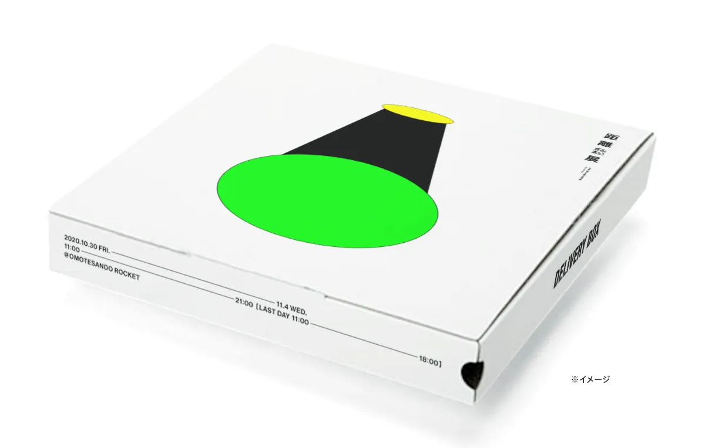
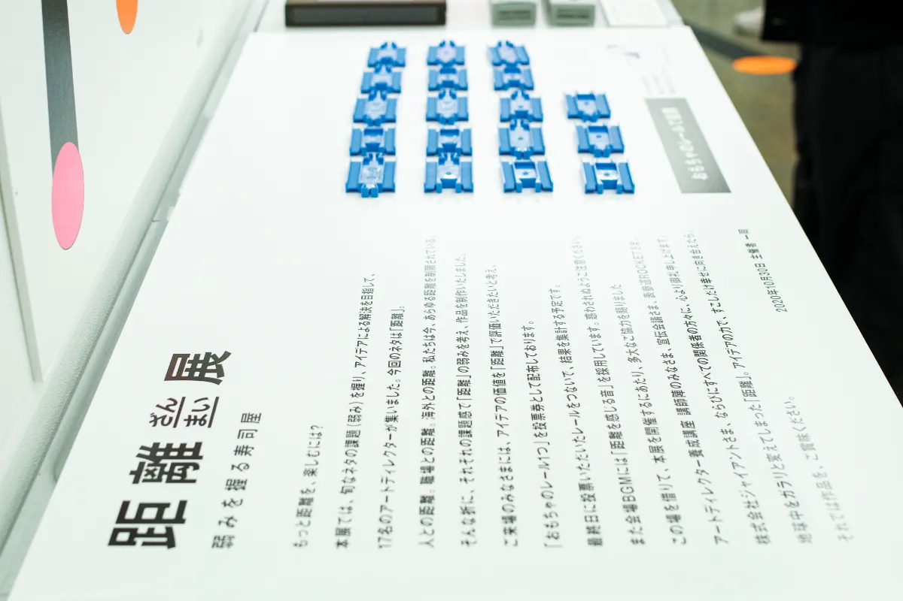
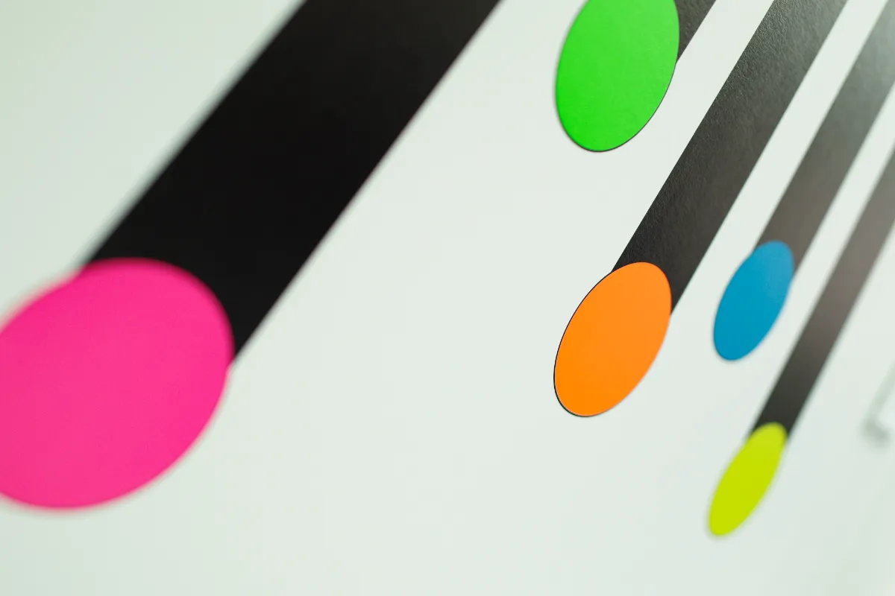
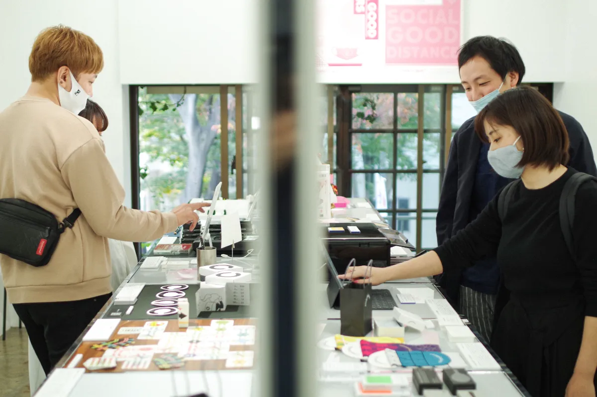
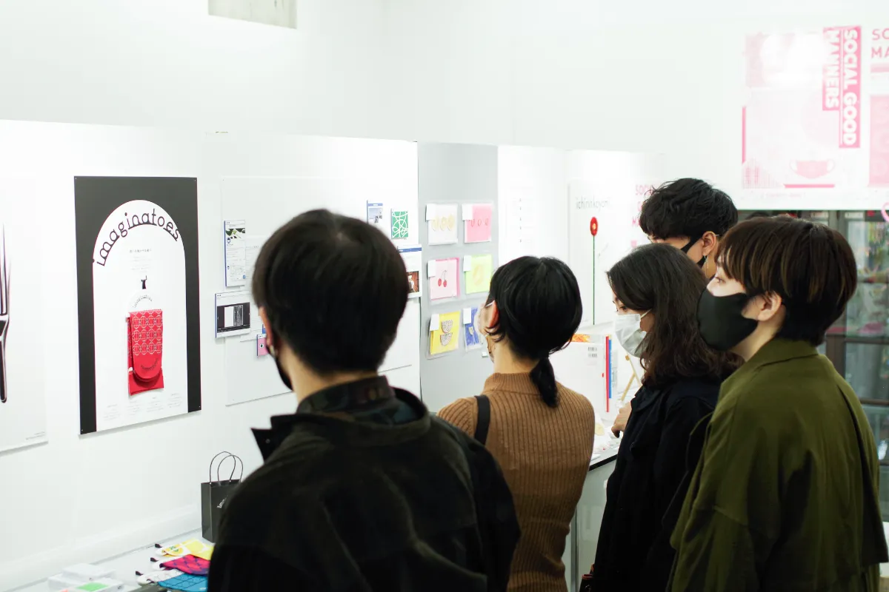
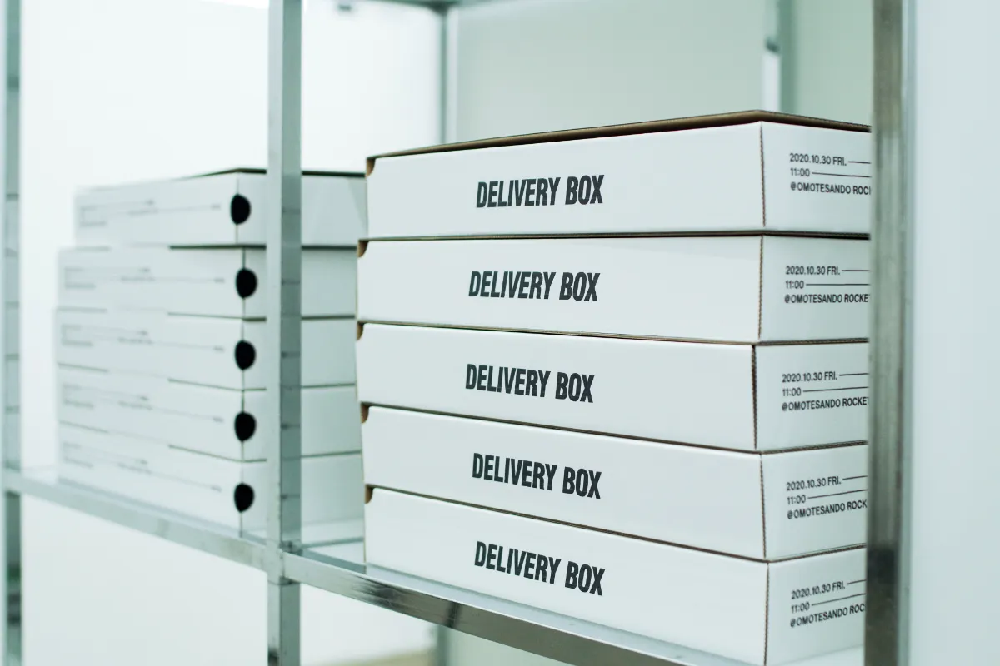

How can we enjoy distance more?

At "Distance Zanmai Exhibit," seventeen art directors from the creative
collective Yowami wo Nigiru Sushiya, whose backgrounds span graphic design,
media art, product design, and more, presented previously unreleased works
themed around "distance," a concept that rapidly spread through daily life in
forms such as online classes, remote work, no-audience concerts, and social
distancing. Each piece began by identifying a challenge or "weakness" related
to distance and proposing a response to it.

At the venue, we handed out toy train tracks as voting tickets so visitors
could evaluate ideas about distance through distance itself.

At the end, we connected all of the submitted tracks to tally the results. For
the background music, we chose sounds that make you instinctively turn around
and feel distance.

We also offered a delivery service for the works so people could enjoy the
exhibition from home: when ordered through the website, a curated package of
pieces was delivered on Saturdays, Sundays, and holidays only.

In this way, visitors could enjoy a "Distance Zanmai Exhibit" that somehow
made distance disappear.

## Distance to the Venue

Following the "Distance Zanmai" concept, we created a web application that
measured the distance from the location where you opened the website to the
venue. In the video below, the viewer travels by train from Yokohama Station
toward Omotesando, where the exhibition was held.

We designed five different animations to appear depending on how close you
were to the venue.

<iframe
  src="https://www.youtube.com/embed/RkzpzpygQIk?si=6GvnGzebowuhKC2V"
  title="YouTube video player"
  allowfullscreen
  style="display: block; width: 100%; aspect-ratio: 16 / 9; border: 0; margin-bottom: 32px"
></iframe>

The exhibition was created by the creative team Yowami wo Nigiru Sushiya.
CurioSwitch was responsible for planning, project management, and the
exhibition materials.
