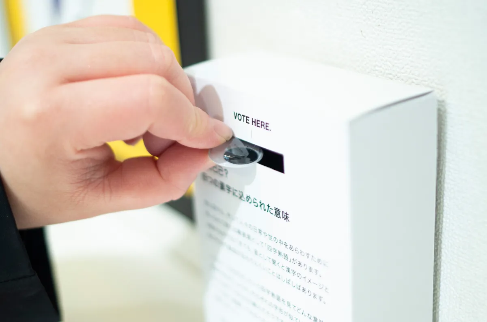
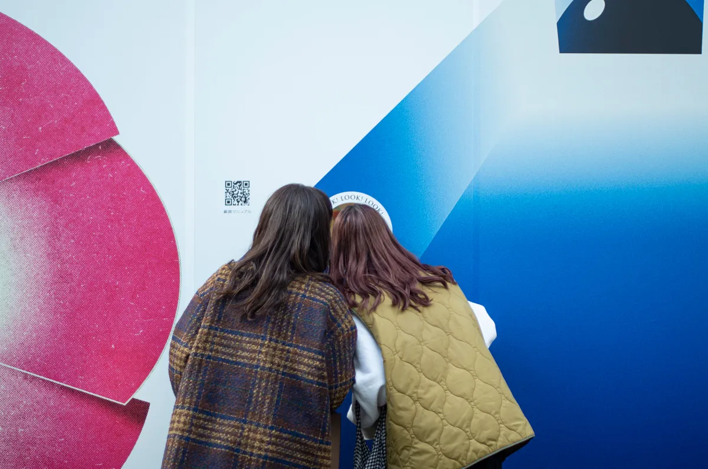
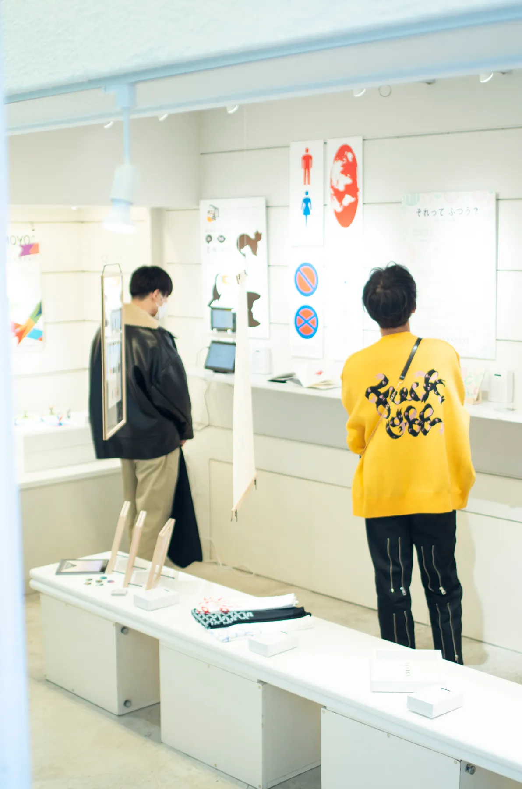
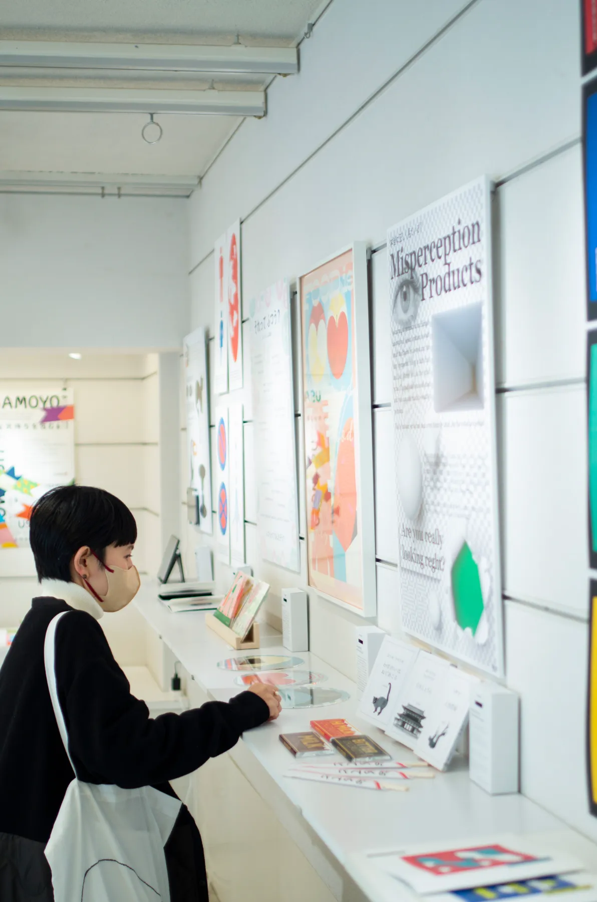

Appearance has tremendous influence, for better or worse. What meaning does
appearance hold, and what does it communicate to us?
Are the impressions we receive from looks really accurate?

We can misjudge things or lose sight of the essence because of appearance. We
observed appearance-related issues and "weaknesses" such as food discarded
because it looks imperfect, social pressure that is overly fearful of visible
aging, and insects hated purely for how they look, then created works that
explore the gap between appearance and essence.

We gave each visitor one eyeball sticker so they could vote for the idea that
caught their eye the most.

## Japan's First Exhibition You Could View After Closing?!

This exhibition was designed as Japan's first exhibition that could still be
viewed after closing hours. We installed peepholes in the venue windows and
kept the lights on 24 hours a day so visitors could continue seeing some of
the works after the venue had closed.

## Output / Result

Through announcements on the web, social media, and press releases, the
exhibition welcomed around 800 visitors. It was also featured on the
nationwide news program NEWS ZERO.

The exhibition was created by the creative team Yowami wo Nigiru Sushiya.
CurioSwitch was responsible for planning, project management, and the
exhibition materials.
