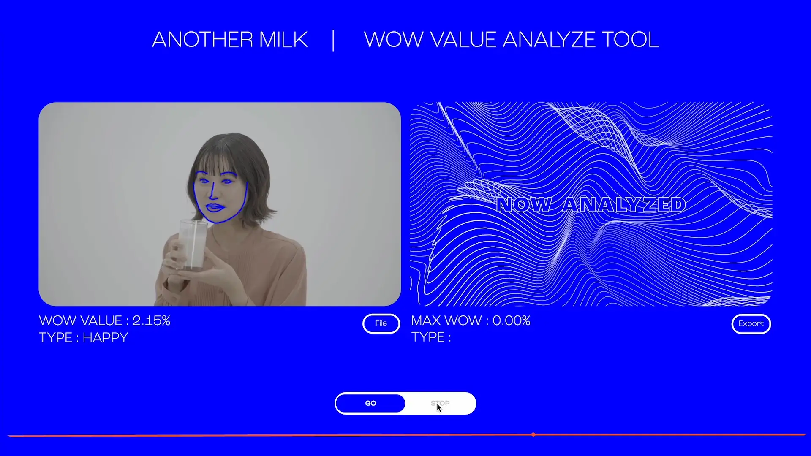
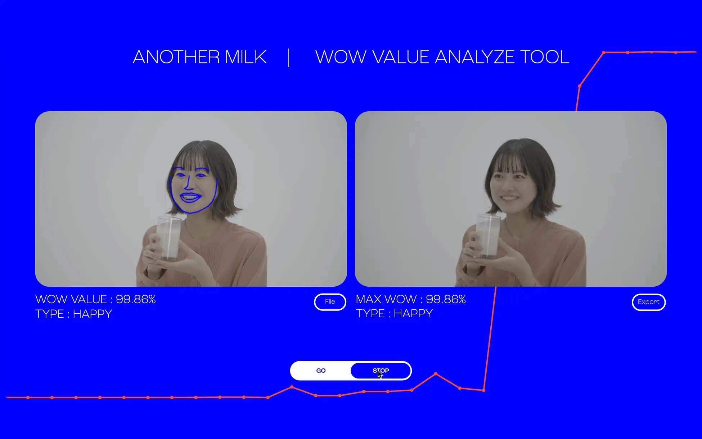
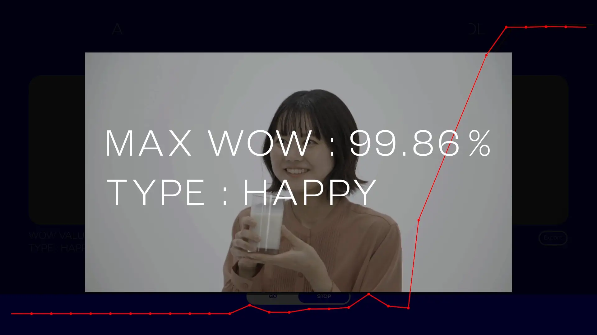
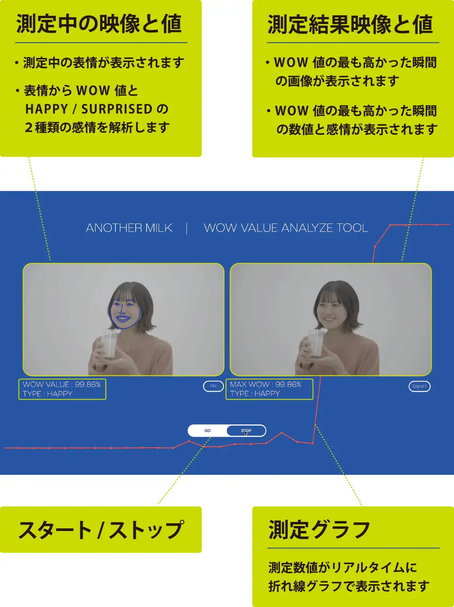

## 生活クラブ「Another Milk」 × WOW値判定ツール

生活クラブが取り組む“パスチャライズド牛乳”の魅力発信プロジェクトにおいて、一般の方が初めて飲んだ瞬間のリアクションをAIで解析し、“WOW値”として表示する仕組みを担当しました。

- 動画から顔の特徴点を抽出
- 7感情のうち「喜び」「驚き」をAIで解析
- 最もWOW値が高かった瞬間を画像とスコアで表示
- 表情の変化を折れ線グラフとして可視化

言葉だけでは伝えきれない“味わった瞬間の幸福感や驚き”を、WOW値と定義。\
誰もが理解できる客観的なデータとして表現しました。

▶︎ プロジェクト動画（生活クラブ公式）
short ver: [https://youtu.be/mSM1ESp3g7s](https://youtu.be/mSM1ESp3g7s)
long ver: [https://youtu.be/d_QATD1ZL2w](https://youtu.be/d_QATD1ZL2w)

## CurioSwitchの取り組み

CurioSwitchでは、\
AI × 体験デザインを組み合わせ、\
“人の感情や驚き”を可視化するプロジェクトにも挑戦しています。

プロモーション、展示、商品体験、研究用途など、\
WOW値判定ツールを活用した企画のご相談もお気軽にお問い合わせください。