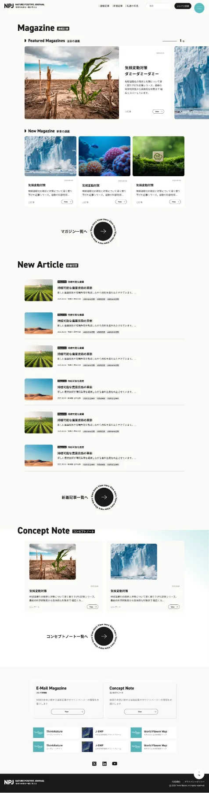
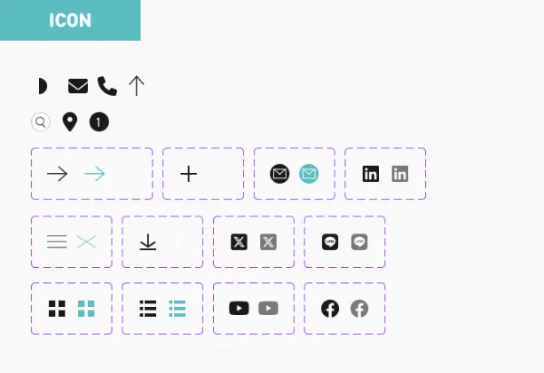
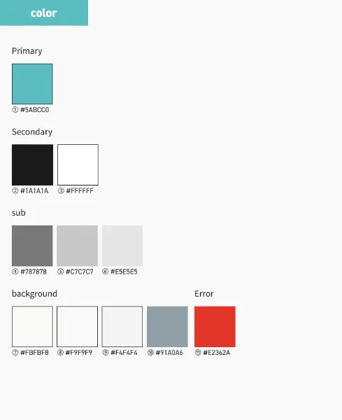
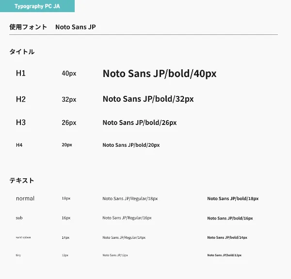

We built Think Nature's media site. We designed the article structure and
information architecture so that
specialized topics such as biodiversity and natural capital can be shared
clearly and continuously.

To provide a consistent experience across both the corporate site and the
media site, we also built a design system.

We organized typography, color, and component design to create a framework
that is easy to update during ongoing operations and flexible enough to
expand.

