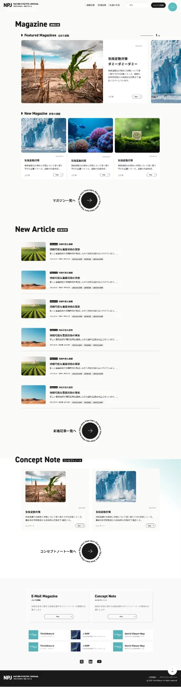
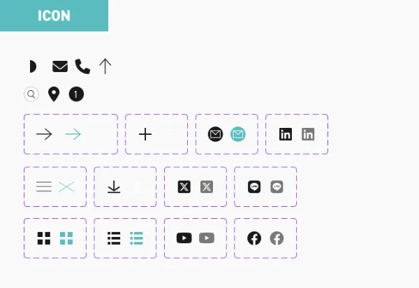
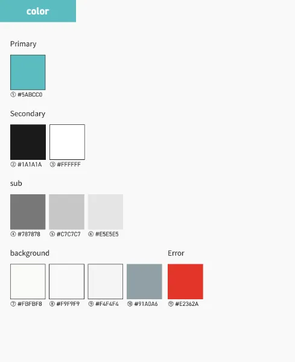
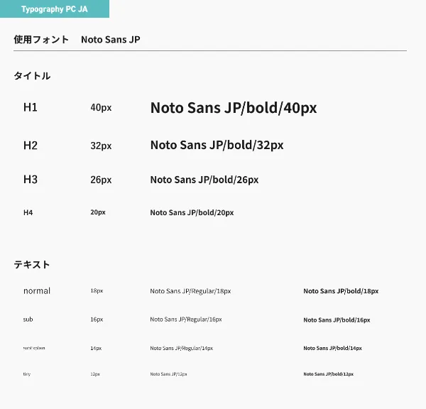

We created "Nature Positive Journal," a media site for Think Nature. It makes
highly specialized topics such as biodiversity and natural capital feel more
accessible to a wider audience and communicates them clearly on an ongoing
basis.

To balance readability with ease of finding information, we considered the
structure of each article and how information should be organized, then
designed the site's overall information architecture. We aimed to create an
experience that makes a continually growing collection of content easy to find
and read.

To provide a consistent experience across both the corporate site and the
media site, we also built a design system.

We organized typography, color, and component design to create a framework
that is easy to update during ongoing operations and flexible enough to
expand.

# CurioSwitch's Role

CurioSwitch was responsible for designing and establishing the design system.
We organized guidelines for typography, color, and UI components, creating a
foundation that maintains design consistency and supports future updates and
expansion.
